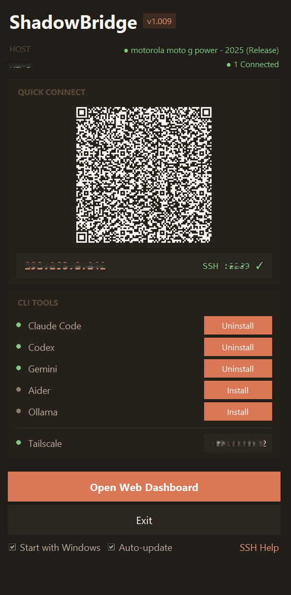
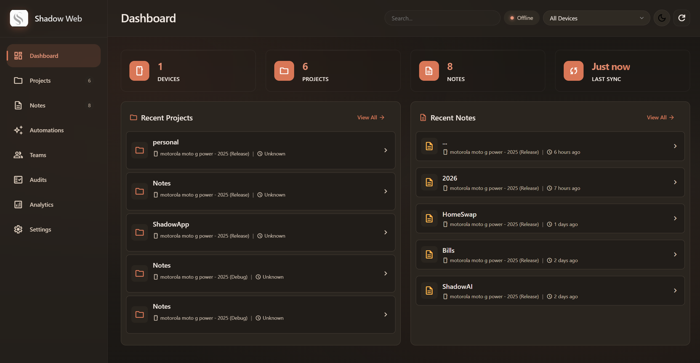

# ShadowBridge

<p align="center">
  
</p>

Secure bridge between your Android device and PC for ShadowAI Android app - enables clipboard sync, SSH key exchange, and Claude Code companion relay.

---

## Shadow Web Dashboard

<p align="center">
  
</p>

ShadowBridge includes a web dashboard at `http://localhost:6767` for managing projects, notes, and team collaboration.

---

## Features

- **Clipboard Sync**: Share clipboard between PC and phone
- **SSH Key Exchange**: Quick Connect for ShadowAI SSH authentication
- **Claude Code Companion**: Relay notifications and approvals between Claude Code and ShadowAI
- **System Tray**: Runs quietly in the background

## Requirements

- Windows 10/11
- Python 3.8+
- [ShadowAI](https://play.google.com/store/apps/details?id=com.shadowai.release) on your Android device

## Installation

### Windows

```bash
pip install -r requirements.txt
python shadow_bridge_gui.py
```

For a more native Windows experience you can build the MSI installer via `python setup.py bdist_msi` (see [docs/windows-installer.md](docs/windows-installer.md)). The resulting MSI skips the ~2.5 GB PyTorch + AudioCraft bundle, so follow the manual audio dependency steps in that guide after installing the base app.

### Linux

For Linux users, a build script is provided to automate the setup:

```bash
# Make the script executable
chmod +x build_linux.sh

# Run the build script
./build_linux.sh
```

This will create a virtual environment, install dependencies, and build the executable in `dist/ShadowBridge/ShadowBridge`.

For troubleshooting and system dependencies, see [README_LINUX.md](README_LINUX.md).

## Ports

| Port | Purpose |
|------|---------|
| 19284 | Data receiver (clipboard, keys) |
| 19285 | Discovery broadcast |
| 19286 | Claude Code Companion relay |

## Usage

1. Run ShadowBridge on your PC
2. Open ShadowAI on your phone
3. Use Quick Connect to pair (scan QR or network discovery)
4. Done! Clipboard sync and SSH keys are now shared

## Claude Code Companion

ShadowBridge includes a relay server for the [claude-shadow](https://github.com/alrightryanx/claude-shadow) plugin:

- Receives approval requests from Claude Code
- Forwards to ShadowAI on your phone
- Returns approval/denial responses
- Syncs replies to PC clipboard

## Privacy

- All communication is direct between your devices (local network or via [Tailscale](https://tailscale.com))
- No data is sent to external servers
- Works across any network with Tailscale VPN

## App Behavior (Exit & Uninstall)

- **Upon Exit**: Closing the application or choosing **Exit** from the system tray stops all background services (Discovery, Data Receiver, Web Dashboard, and Companion Relay). Your settings and data (projects, notes, and session logs) are saved locally in `%USERPROFILE%\.shadowai`.
- **Upon Uninstall**: Using the Windows "Uninstall a program" feature removes the application files from `Program Files` and the desktop shortcut.
  - **Persistence**: To prevent accidental data loss, the `%USERPROFILE%\.shadowai` directory (containing your notes and project metadata) and the registered SSH keys are **not removed** automatically.
  - **Cleanup**: To perform a full cleanup after uninstalling, manually delete the `%USERPROFILE%\.shadowai` and `%APPDATA%\ShadowBridge` folders.

## License

MIT License - See [LICENSE](LICENSE) for details.

## Links

- [ShadowAI Website](https://ryancartwright.com/shadowai)
- [Claude Shadow Plugin](https://github.com/alrightryanx/claude-shadow)
